### DeliverySystem
++++
user front-end (html + css + js) 
+ back-end (java) 
+ MySQL

Highlight in our project:
1. handwriten MVC
2. privide both buyer-end & seller-end
3. Implement basic but complete business processes

## How about the final file structure?

## Our Design process & web structure.
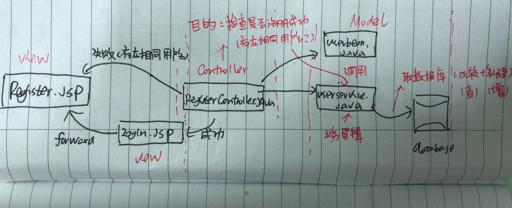

## How about the main functions?

## Our WebPage Preview! Have a look!
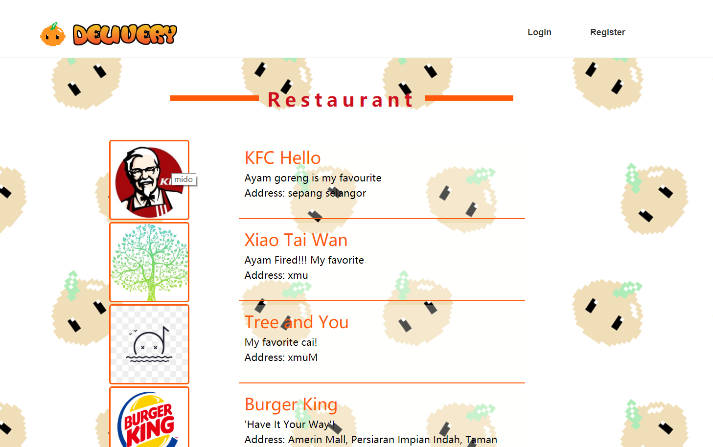

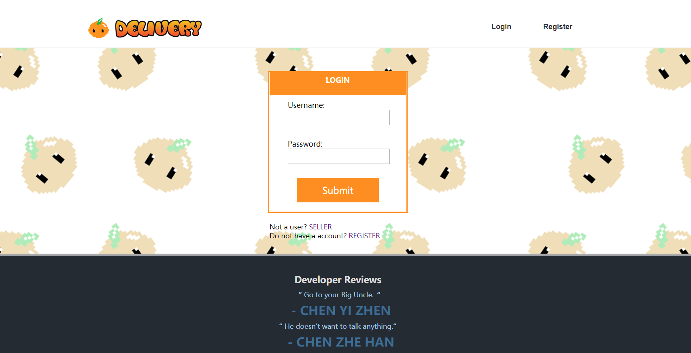

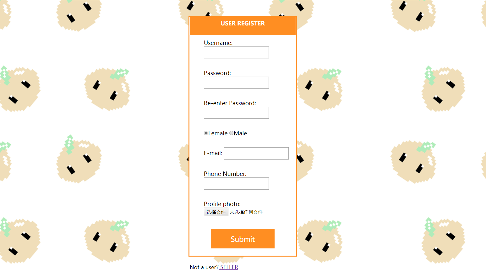

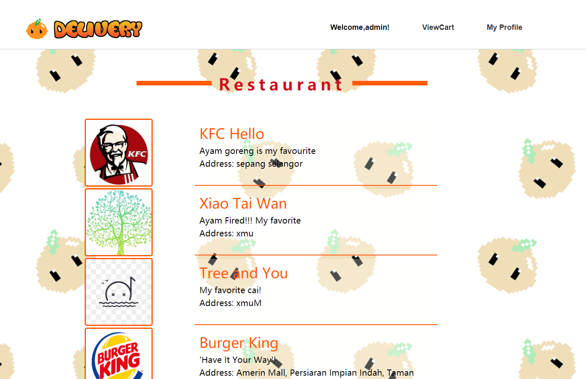

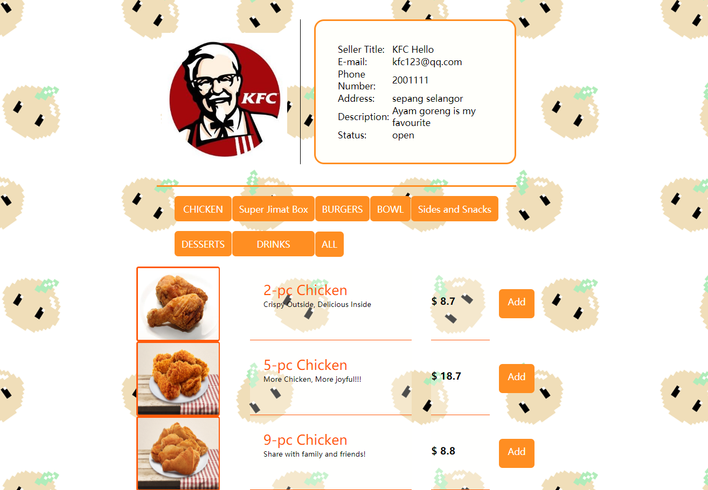

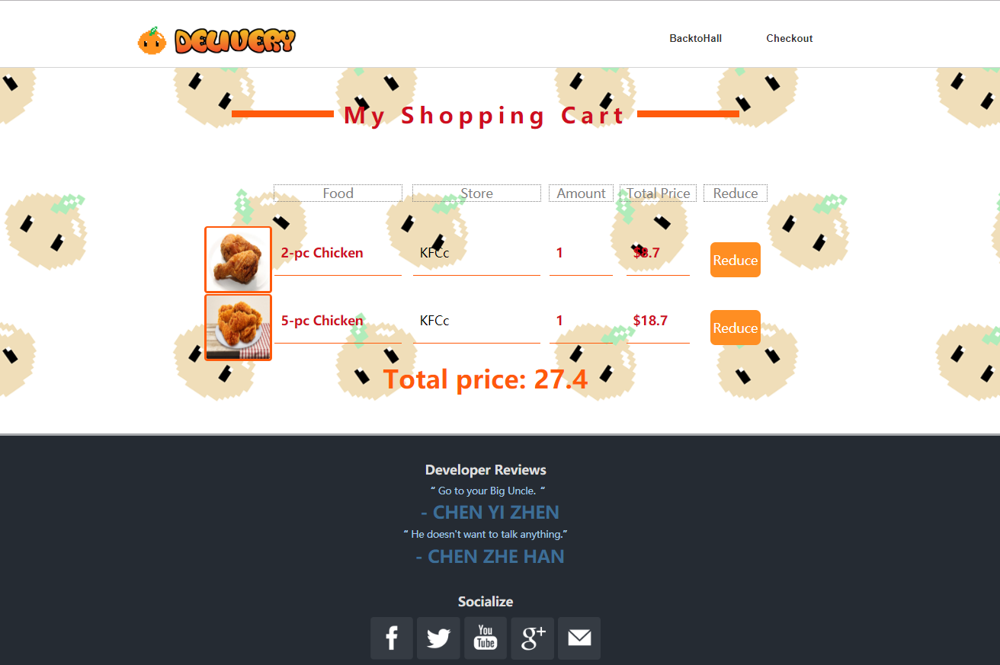

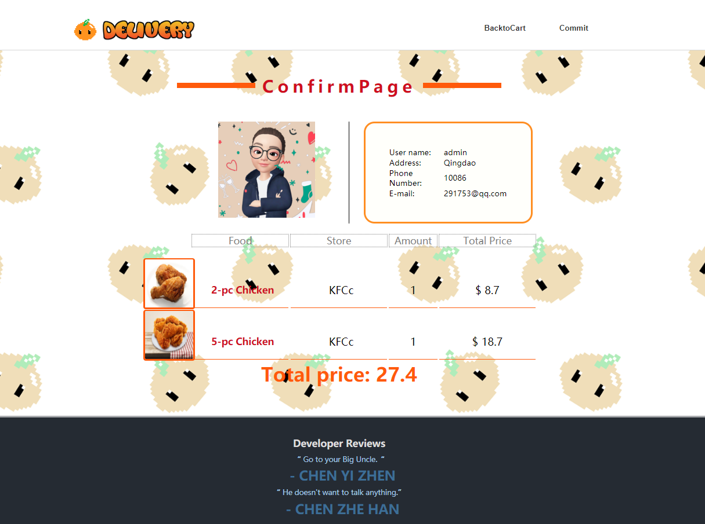

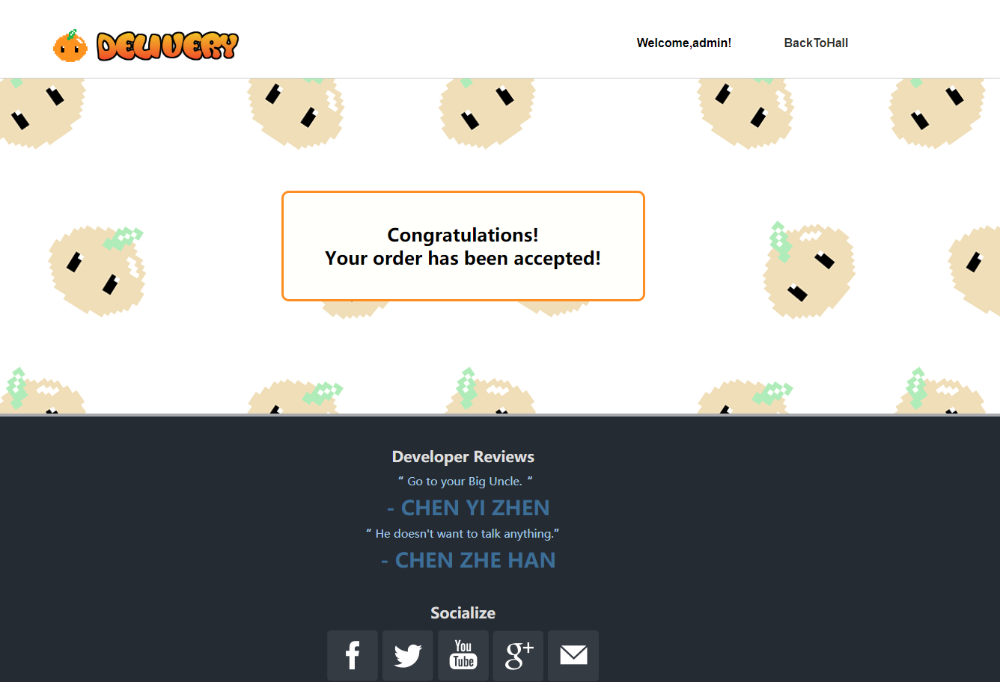

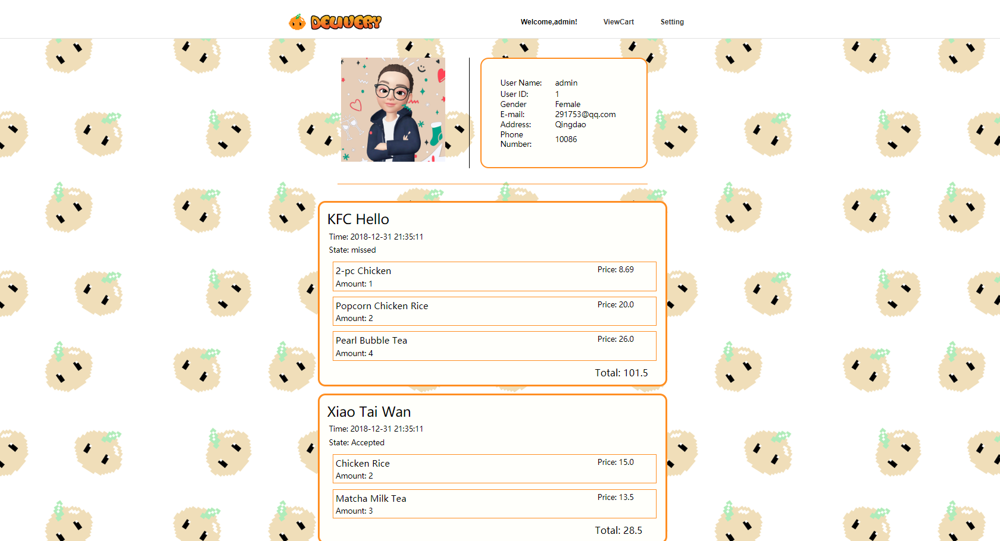

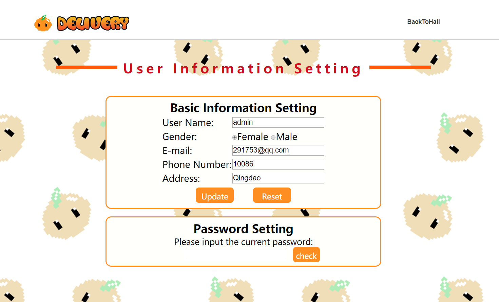

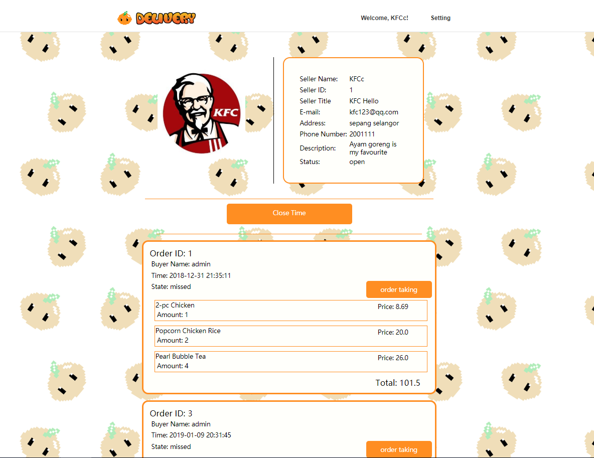

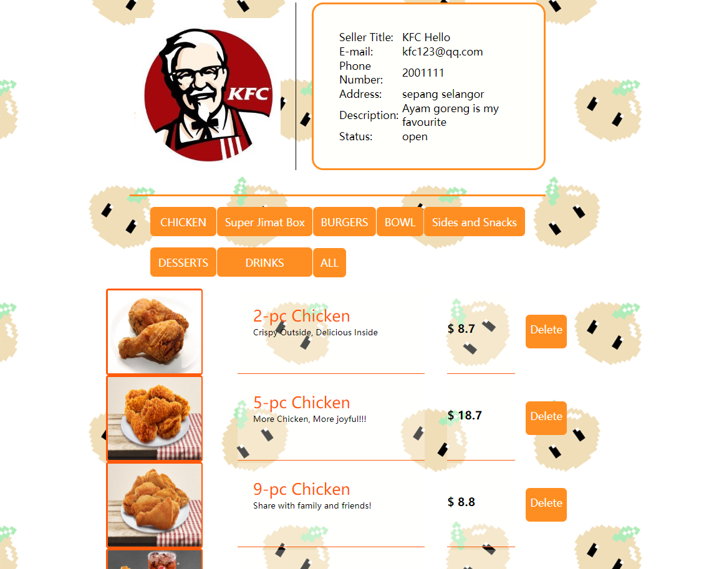

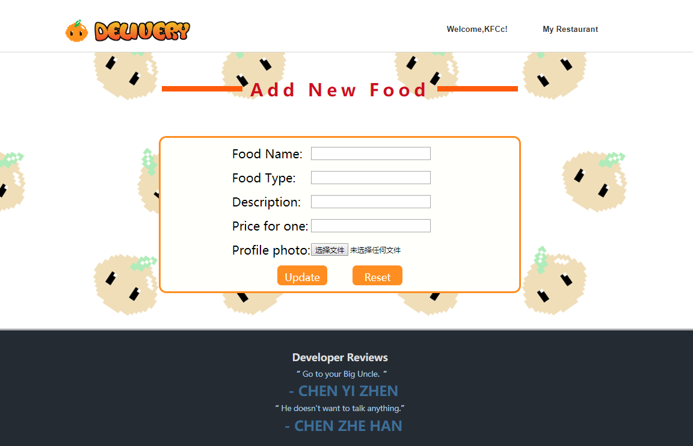
